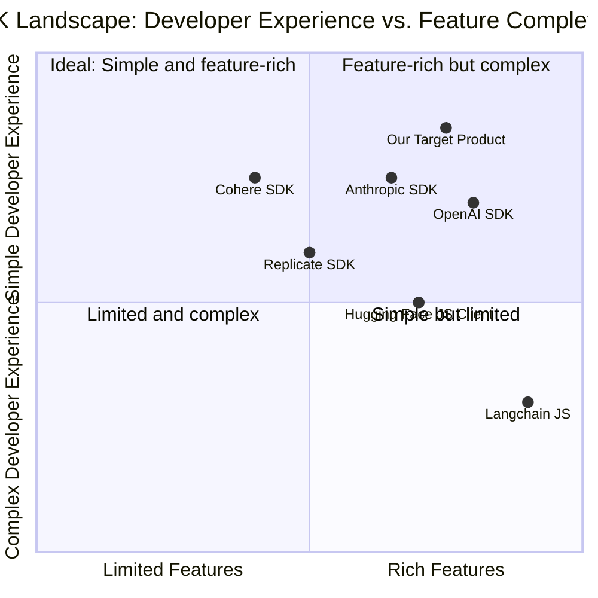
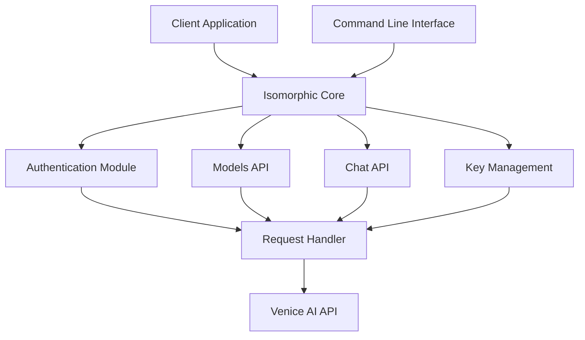

# Product Requirements Document (PRD): Venice AI SDK

## Project Information
- **Project Name**: venice_ai_sdk
- **Programming Language**: JavaScript/TypeScript
- **Original Requirements**: Build a complete SDK for Venice AI API (https://api.venice.ai/doc/api/swagger.yaml), including an isomorphic core with webpack and CLI packages, supporting commands like `venice chat "what is AI?"`, `venice list-keys`, and `venice list-models`.

## 1. Product Definition

### 1.1 Product Goals
- Create an easy-to-use, isomorphic SDK that works seamlessly in both browser and Node.js environments
- Provide a user-friendly CLI interface for quick access to Venice AI capabilities
- Ensure full compatibility with the Venice AI API while abstracting away complexity

### 1.2 User Stories

1. **As a developer**, I want to integrate Venice AI text generation capabilities into my web application, so that I can enhance my app with AI features without handling complex API interactions.

2. **As a developer**, I want to use the Venice AI SDK in both browser and server environments with the same API surface, so that I can maintain consistent code across my frontend and backend.

3. **As a CLI user**, I want to quickly generate AI text responses without writing code, so that I can experiment with the Venice AI capabilities directly from my terminal.

4. **As a team administrator**, I want to list and manage my Venice AI API keys through a CLI, so that I can securely handle authentication without accessing the web dashboard.

5. **As a developer**, I want to explore available Venice AI models through a simple interface, so that I can make informed decisions about which models to use for different purposes.

### 1.3 Competitive Analysis

| Product | Pros | Cons |
|---------|------|------|
| **OpenAI SDK** | - Clean, simple API design<br>- Comprehensive TypeScript typings<br>- Built-in streaming support<br>- Rich documentation | - Not isomorphic by default<br>- Limited CLI capabilities<br>- Complex error handling patterns |
| **Anthropic SDK** | - Focus on clean API surface<br>- Good TypeScript support<br>- Handles retries elegantly | - No CLI functionality<br>- Limited browser support<br>- Less mature than alternatives |
| **Hugging Face JS Client** | - Broad model support<br>- Simple interface<br>- Community-driven | - Limited CLI features<br>- Inconsistent error handling<br>- Less structured response formats |
| **Langchain JS** | - Framework for chaining operations<br>- Flexible architecture<br>- Strong community support | - Higher complexity<br>- Learning curve for basic use cases<br>- Overkill for simple interactions |
| **Replicate SDK** | - Clean design<br>- Good documentation<br>- Webhook support | - Limited model variety<br>- Fixed pricing model<br>- No isomorphic design |
| **Cohere SDK** | - Simple and intuitive API<br>- Good JavaScript integration<br>- Clear error messages | - No CLI tools<br>- Limited advanced features<br>- No streaming in browser |

### 1.4 Competitive Quadrant Chart



## 2. Technical Specifications

### 2.1 Requirements Analysis

The Venice AI SDK needs to provide a comprehensive interface to the Venice AI API, focusing on flexibility, ease of use, and compatibility across different JavaScript environments. The SDK must include:

1. **Isomorphic Core Library**:
   - Must work in both browser and Node.js environments
   - Must handle environment-specific concerns transparently
   - Must provide consistent API surface regardless of environment

2. **Authentication Management**:
   - Must support API key-based authentication
   - Must provide secure storage and retrieval of API keys
   - Should support multiple authentication profiles

3. **Venice AI API Integration**:
   - Must support all key endpoints from the Venice AI API
   - Must provide both promise-based and callback-based interfaces
   - Must include streaming support for applicable endpoints

4. **CLI Interface**:
   - Must provide command-line access to core functionality
   - Must support interactive mode and direct command execution
   - Must include help documentation and examples

5. **Developer Experience**:
   - Must include comprehensive TypeScript typings
   - Must provide detailed error messages and handling
   - Should include extensive documentation and examples

### 2.2 Requirements Pool

#### P0 (Must Have)

1. **Core SDK Implementation**
   - Isomorphic architecture working in both Node.js and browser environments
   - Full Venice API endpoint coverage (models, chat completions)
   - Comprehensive TypeScript definitions
   - Error handling with informative messages

2. **Authentication**
   - API key management and secure storage
   - Environment variable integration (VENICE_API_KEY)
   - Multi-profile support (different API keys for different environments)

3. **CLI Interface**
   - Command implementation: `venice chat "[prompt]"`
   - Command implementation: `venice list-models`
   - Command implementation: `venice list-keys`
   - Help command and documentation: `venice help`

4. **Documentation**
   - README with installation and basic usage
   - API reference for all methods
   - CLI command reference
   - Code examples for common use cases

#### P1 (Should Have)

1. **Advanced SDK Features**
   - Streaming response support
   - Rate limiting and retry logic
   - Response formatting options
   - Timeout handling and cancellation

2. **Extended CLI Capabilities**
   - Interactive mode (`venice interactive`)
   - Configuration management (`venice config`)
   - Model filtering and search (`venice list-models --capabilities=json`)
   - Output formatting (JSON, plain text, markdown)

3. **Developer Tools**
   - Playground/debug mode
   - Logging options with different verbosity levels
   - Request/response inspection
   - Performance metrics

#### P2 (Nice to Have)

1. **Enhanced Features**
   - TypeScript type generation from response schemas
   - Caching mechanisms for responses
   - Batch operations
   - Webhook integration for async operations

2. **Additional CLI Tools**
   - `venice key-create` - Create new API keys
   - `venice key-revoke` - Revoke existing API keys
   - `venice completion-stats` - View API usage statistics
   - `venice export/import` - Export/import conversation history

3. **Integration Helpers**
   - React hooks library
   - Express middleware
   - Next.js integration
   - Vue.js plugin

### 2.3 UI Design Draft

#### CLI Interface Design

1. **Command Structure**
   ```
   venice <command> [options] [arguments]
   ```

2. **Help Output**
   ```
   Usage: venice [command] [options]

   Commands:
     chat <prompt>            Generate a chat response
     list-models              List available AI models
     list-keys                List stored API keys
     help [command]           Display help for command

   Options:
     -v, --version            Output version information
     -h, --help               Display help for command
     -o, --output <format>    Output format (text, json, markdown)
     -k, --key <key>          Use specific API key
     -m, --model <model>      Specify model to use
   ```

3. **Example Commands**
   ```
   $ venice chat "What is artificial intelligence?"
   > Artificial intelligence (AI) refers to the simulation of human intelligence in machines...

   $ venice list-models --output json
   > [{
       "id": "llama-3.3-70b",
       "capabilities": ["text-generation", "function-calling"],
       "contextWindow": 128000
     }, ...]

   $ venice list-keys
   > Available API keys:
     - default: sk_ven_****abcd (active)
     - test: sk_ven_****efgh
   ```

#### SDK Interface Design

1. **Initialization**
   ```javascript
   // Node.js
   const { VeniceAI } = require('venice-ai-sdk');
   
   // Browser
   import { VeniceAI } from 'venice-ai-sdk';
   
   const venice = new VeniceAI({
     apiKey: 'sk_ven_...',
     defaultModel: 'llama-3.3-70b'
   });
   ```

2. **Chat Completion**
   ```javascript
   // Promise-based
   const response = await venice.chat.completions.create({
     messages: [
       { role: 'user', content: 'What is AI?' }
     ],
     model: 'llama-3.3-70b'
   });
   
   console.log(response.choices[0].message.content);
   
   // Streaming
   const stream = await venice.chat.completions.create({
     messages: [{ role: 'user', content: 'Tell me a story' }],
     model: 'llama-3.3-70b',
     stream: true
   });
   
   for await (const chunk of stream) {
     process.stdout.write(chunk.choices[0]?.delta?.content || '');
   }
   ```

3. **Model Listing**
   ```javascript
   const models = await venice.models.list();
   console.log(models.data);
   ```

4. **Key Management**
   ```javascript
   // List API keys
   const keys = await venice.keys.list();
   console.log(keys);
   ```

### 2.4 Open Questions

1. **API Key Management**:
   - How should API keys be securely stored locally for the CLI?
   - Should we implement key rotation or expiry management?

2. **Error Handling**:
   - How detailed should error messages be for different types of failures?
   - What retry strategies should be implemented for transient failures?

3. **Compatibility**:
   - How should we handle compatibility with future Venice API changes?
   - To what extent should we maintain compatibility with OpenAI's SDK interface?

4. **Performance**:
   - What optimization techniques should be implemented for browser environments?
   - How should we handle large response payloads in memory-constrained environments?

5. **CLI Enhancement**:
   - Should we implement an interactive shell mode similar to Python's REPL?
   - How should we handle multi-turn conversations in the CLI?

## 3. Implementation Plan

### 3.1 Architecture Overview



### 3.2 Package Structure

```
/venice-ai-sdk
  /packages
    /core                 # Isomorphic core package
      /src
        /api              # API implementation
        /utils            # Utilities
        /types            # TypeScript types
        index.ts          # Main entry point
    /node                 # Node.js specific code
      /src
        /cli              # CLI implementation
        /utils            # Node-specific utilities
        index.ts          # Node.js entry point
        cli.ts            # CLI entry point
    /web                  # Browser-specific code
      /src
        /adapters         # Browser adapters
        index.ts          # Browser entry point
  package.json            # Workspace config
  README.md               # Documentation
```

## 4. Conclusion

The Venice AI SDK will provide a comprehensive, user-friendly interface to the Venice AI API, with both programmatic and command-line access options. By adopting an isomorphic architecture, it will enable developers to use the same code in both browser and Node.js environments, simplifying integration and reducing development effort.

The SDK will prioritize developer experience with clear documentation, helpful error messages, and intuitive interfaces. It will support all required functionality including chat completions, model listing, and API key management, with room for future expansion as the Venice AI platform evolves.

By analyzing competing products and focusing on the identified user needs, the Venice AI SDK aims to position itself as a developer-friendly, feature-rich solution in the AI SDK landscape.