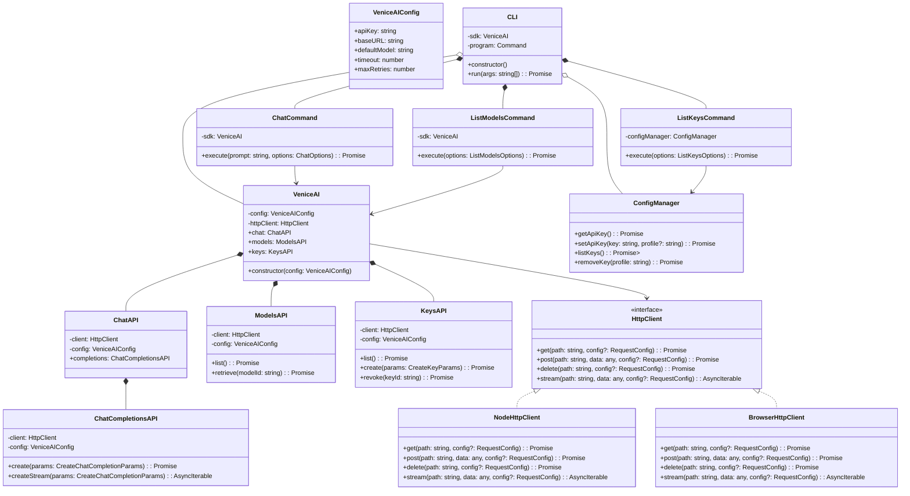
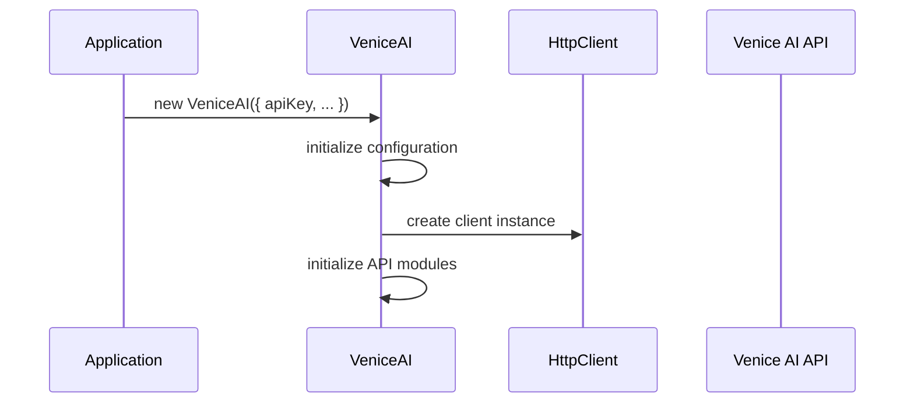
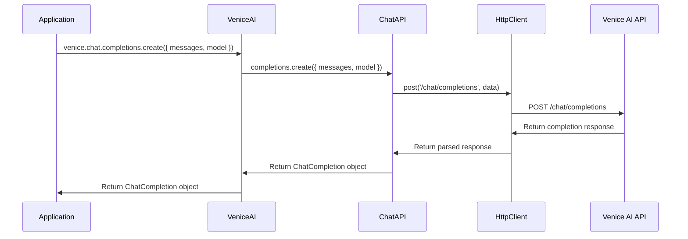
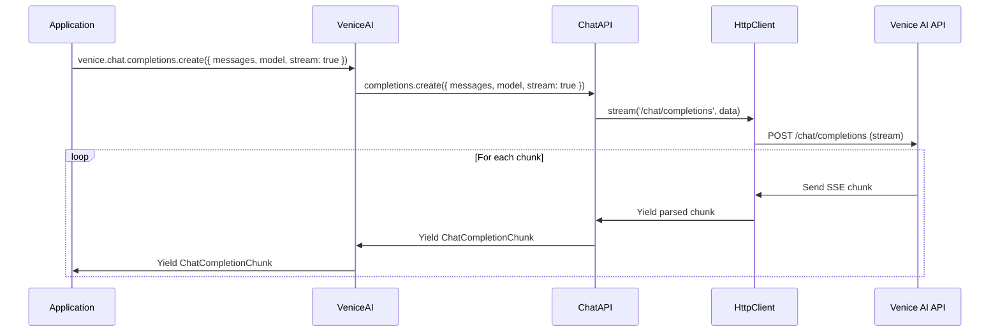
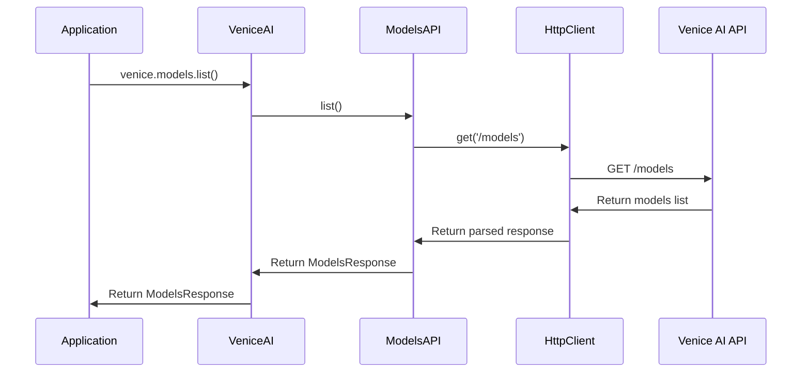
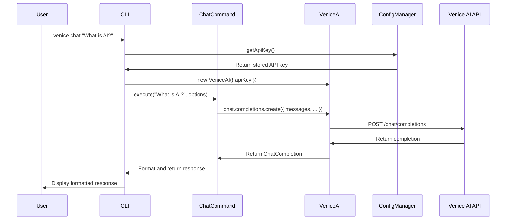
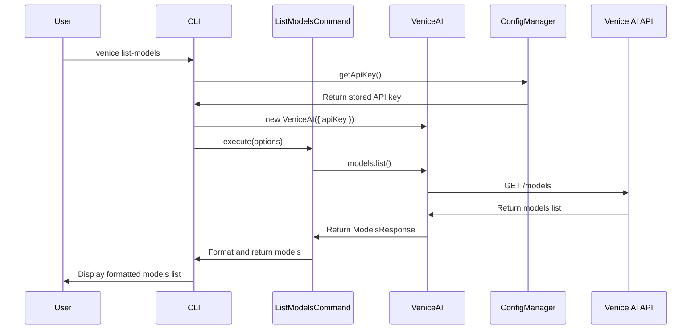
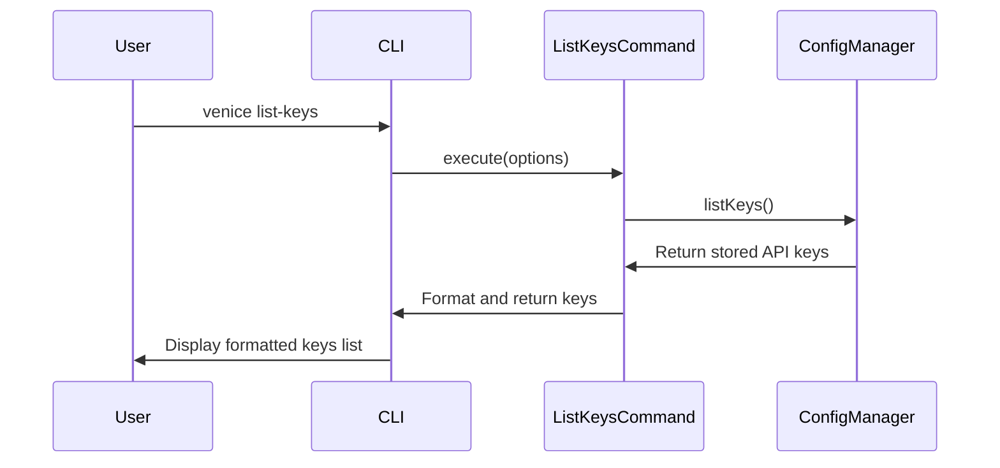

# Venice AI SDK System Design

## Implementation approach

Based on the requirements and the PRD, we'll create an isomorphic SDK for the Venice AI API with a focus on developer experience and cross-platform compatibility. The key implementation decisions are:

1. **Isomorphic Architecture**: We'll create a core library that works identically in both Node.js and browser environments, using appropriate adapters for environment-specific functionality (like HTTP requests and storage).

2. **TypeScript**: To provide excellent developer experience with type safety and autocompletion, we'll use TypeScript for the entire codebase.

3. **Package Structure**: We'll use a monorepo structure with three main packages:
   - `@venice-ai/core`: The isomorphic core library
   - `@venice-ai/node`: Node.js specific functionality including CLI
   - `@venice-ai/web`: Browser-specific functionality and bundling

4. **API Design**: We'll mirror the OpenAI SDK structure where appropriate for familiarity, while adding Venice-specific enhancements.

5. **Bundle Strategy**: For browser environments, we'll use webpack to create both UMD and ESM bundles with tree-shaking support.

6. **CLI Architecture**: The CLI will be built on top of Commander.js for robust command-line parsing and a clean implementation.

7. **Error Handling**: We'll implement comprehensive error handling with detailed, actionable error messages.

8. **Authentication**: We'll support multiple authentication methods with secure storage of API keys.

## Data structures and interfaces

The SDK will have the following core classes and interfaces:



Core data interfaces will include:

```typescript
interface Message {
  role: 'system' | 'user' | 'assistant' | 'function';
  content: string;
  name?: string;
  function_call?: {
    name: string;
    arguments: string;
  };
}

interface CreateChatCompletionParams {
  model: string;
  messages: Message[];
  temperature?: number;
  top_p?: number;
  max_tokens?: number;
  stream?: boolean;
  functions?: FunctionDefinition[];
  function_call?: string | { name: string };
  stop?: string | string[];
}

interface ChatCompletion {
  id: string;
  object: 'chat.completion';
  created: number;
  model: string;
  choices: Array<{
    index: number;
    message: Message;
    finish_reason: 'stop' | 'length' | 'function_call';
  }>
  usage: {
    prompt_tokens: number;
    completion_tokens: number;
    total_tokens: number;
  };
}

interface ChatCompletionChunk {
  id: string;
  object: 'chat.completion.chunk';
  created: number;
  model: string;
  choices: Array<{
    index: number;
    delta: Partial<Message>;
    finish_reason: 'stop' | 'length' | 'function_call' | null;
  }>;
}

interface Model {
  id: string;
  object: 'model';
  created: number;
  owned_by: string;
  capabilities: string[];
  contextWindow: number;
}

interface ModelsResponse {
  object: 'list';
  data: Model[];
}

interface Key {
  id: string;
  object: 'api_key';
  name: string;
  created: number;
  last_used?: number;
}

interface KeysResponse {
  object: 'list';
  data: Key[];
}

interface CreateKeyParams {
  name: string;
}

interface RevokeKeyResponse {
  id: string;
  object: 'api_key.deleted';
  deleted: boolean;
}
```

## Program call flow

Below is the sequence diagram showing the main interactions in the Venice AI SDK:

1. **SDK Initialization**:



2. **Chat Completion**:



3. **Streaming Chat Completion**:



4. **List Models**:



5. **CLI Chat Command**:



6. **CLI List Models Command**:



7. **CLI List Keys Command**:



## Webpack Configuration

For the browser bundle, we'll use webpack with the following configuration approach:

```javascript
// webpack.config.js
const path = require('path');
const TerserPlugin = require('terser-webpack-plugin');

module.exports = {
  entry: './src/index.ts',
  module: {
    rules: [
      {
        test: /\.tsx?$/,
        use: 'ts-loader',
        exclude: /node_modules/,
      },
    ],
  },
  resolve: {
    extensions: ['.tsx', '.ts', '.js'],
    fallback: {
      'stream': require.resolve('stream-browserify'),
      'buffer': require.resolve('buffer/'),
      'util': require.resolve('util/'),
    },
  },
  output: {
    path: path.resolve(__dirname, 'dist'),
    filename: 'venice-ai.min.js',
    library: {
      name: 'VeniceAI',
      type: 'umd',
      export: 'default',
    },
  },
  optimization: {
    minimize: true,
    minimizer: [new TerserPlugin()],
  },
};
```

## CLI Implementation

The CLI will be implemented using Commander.js with the following structure:

```typescript
// cli.ts
import { Command } from 'commander';
import { ChatCommand } from './commands/chat';
import { ListModelsCommand } from './commands/list-models';
import { ListKeysCommand } from './commands/list-keys';
import { ConfigManager } from './utils/config-manager';
import { VeniceAI } from '@venice-ai/core';

export class CLI {
  private program: Command;
  private configManager: ConfigManager;
  
  constructor() {
    this.program = new Command();
    this.configManager = new ConfigManager();
    this.setupProgram();
  }
  
  private setupProgram() {
    this.program
      .name('venice')
      .description('Venice AI command-line interface')
      .version('1.0.0');
      
    // Chat command
    this.program
      .command('chat <prompt>')
      .description('Generate a chat response')
      .option('-m, --model <model>', 'Specify model to use')
      .option('-o, --output <format>', 'Output format (text, json, markdown)')
      .option('-k, --key <key>', 'Use specific API key')
      .action(async (prompt, options) => {
        const apiKey = options.key || await this.configManager.getApiKey();
        if (!apiKey) {
          console.error('No API key found. Please set an API key with venice config set apiKey YOUR_KEY');
          process.exit(1);
        }
        
        const sdk = new VeniceAI({ apiKey });
        const command = new ChatCommand(sdk);
        await command.execute(prompt, options);
      });
      
    // List models command
    this.program
      .command('list-models')
      .description('List available AI models')
      .option('-o, --output <format>', 'Output format (text, json, markdown)')
      .option('-k, --key <key>', 'Use specific API key')
      .action(async (options) => {
        const apiKey = options.key || await this.configManager.getApiKey();
        if (!apiKey) {
          console.error('No API key found. Please set an API key with venice config set apiKey YOUR_KEY');
          process.exit(1);
        }
        
        const sdk = new VeniceAI({ apiKey });
        const command = new ListModelsCommand(sdk);
        await command.execute(options);
      });
      
    // List keys command
    this.program
      .command('list-keys')
      .description('List stored API keys')
      .option('-o, --output <format>', 'Output format (text, json, markdown)')
      .action(async (options) => {
        const command = new ListKeysCommand(this.configManager);
        await command.execute(options);
      });
  }
  
  public async run(args: string[] = process.argv) {
    await this.program.parseAsync(args);
  }
}

// When running as script
if (require.main === module) {
  const cli = new CLI();
  cli.run().catch(err => {
    console.error('Error:', err.message);
    process.exit(1);
  });
}
```

## Anything UNCLEAR

1. **API Documentation Access**: The swagger documentation at https://api.venice.ai/doc/api/swagger.yaml wasn't accessed directly in this design, so some assumptions were made about the Venice AI API structure. A complete implementation would require detailed analysis of the API documentation.

2. **Authentication Details**: The exact authentication mechanisms supported by the Venice AI API (API keys, OAuth, etc.) would need to be confirmed from the API documentation.

3. **API Key Storage**: For the CLI implementation, we need to determine the most secure way to store API keys locally. Options include environment variables, a configuration file with appropriate permissions, or integration with system keystores.

4. **Error Handling Strategy**: A more detailed error handling strategy would be developed based on the API's error responses and rate limiting behavior.

5. **Streaming Implementation Details**: The exact implementation of streaming responses would depend on how the Venice AI API implements server-sent events or chunked responses.

6. **Venice-Specific Features**: Any unique features of the Venice AI platform not common in similar APIs would need special consideration in the SDK design.