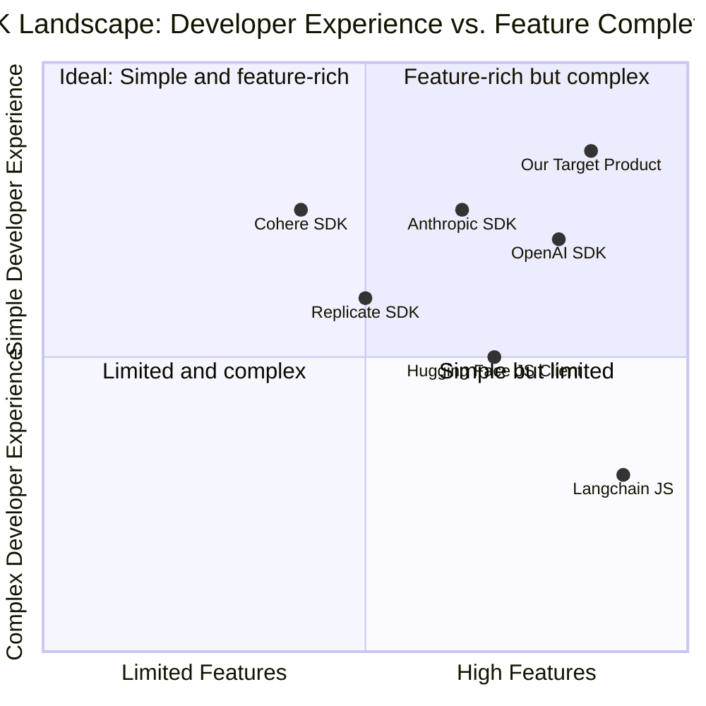
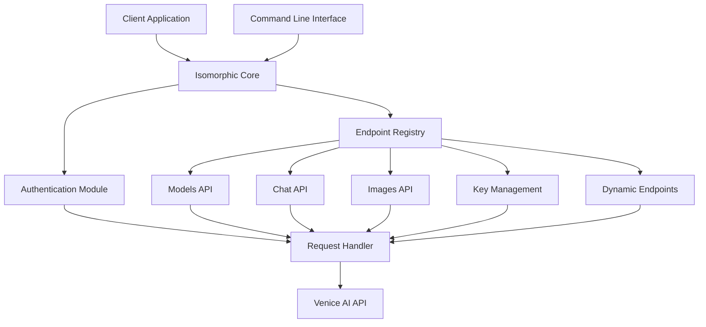
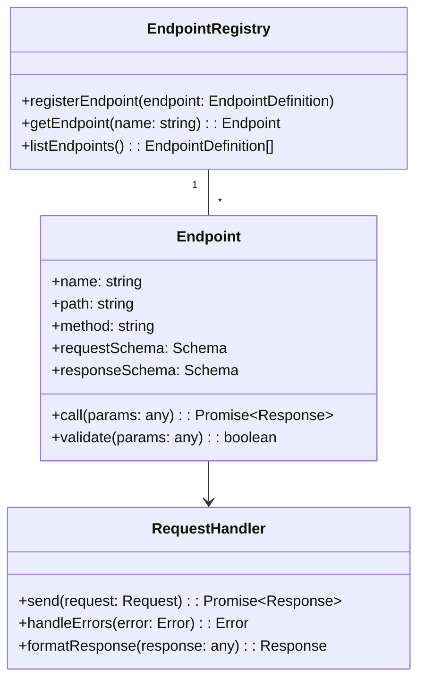

# Product Requirements Document (PRD): Venice AI SDK

## Project Information
- **Project Name**: venice_ai_sdk
- **Programming Language**: JavaScript/TypeScript
- **Original Requirements**: Build a complete SDK for Venice AI API (https://api.venice.ai/doc/api/swagger.yaml), including an isomorphic core with webpack and CLI packages, supporting commands like `venice chat "what is AI?"`, `venice list-keys`, and `venice list-models`.
- **Updated Requirements**: Ensure comprehensive coverage of all Venice AI API endpoints with an architecture designed to facilitate adding and maintaining endpoints as the API evolves.

## 1. Product Definition

### 1.1 Product Goals
- Create an easy-to-use, isomorphic SDK that works seamlessly in both browser and Node.js environments
- Provide a user-friendly CLI interface for quick access to Venice AI capabilities
- Ensure full compatibility with the Venice AI API while abstracting away complexity
- Build a flexible, extensible architecture that enables easy addition and maintenance of endpoints as the API evolves

### 1.2 User Stories

1. **As a developer**, I want to integrate Venice AI text generation capabilities into my web application, so that I can enhance my app with AI features without handling complex API interactions.

2. **As a developer**, I want to use the Venice AI SDK in both browser and server environments with the same API surface, so that I can maintain consistent code across my frontend and backend.

3. **As a developer**, I want access to all Venice AI API endpoints through a consistent interface, so that I can leverage the full capability of the platform.

4. **As a CLI user**, I want to quickly generate AI text responses without writing code, so that I can experiment with the Venice AI capabilities directly from my terminal.

5. **As a team administrator**, I want to list and manage my Venice AI API keys through a CLI, so that I can securely handle authentication without accessing the web dashboard.

6. **As a developer**, I want to explore available Venice AI models through a simple interface, so that I can make informed decisions about which models to use for different purposes.

7. **As an SDK maintainer**, I want an architecture that makes it easy to add new endpoints as the Venice AI API evolves, so that I can keep the SDK up-to-date with minimal effort.

### 1.3 Competitive Analysis

| Product | Pros | Cons |
|---------|------|------|
| **OpenAI SDK** | - Clean, simple API design<br>- Comprehensive TypeScript typings<br>- Built-in streaming support<br>- Rich documentation | - Not isomorphic by default<br>- Limited CLI capabilities<br>- Complex error handling patterns |
| **Anthropic SDK** | - Focus on clean API surface<br>- Good TypeScript support<br>- Handles retries elegantly | - No CLI functionality<br>- Limited browser support<br>- Less mature than alternatives |
| **Hugging Face JS Client** | - Broad model support<br>- Simple interface<br>- Community-driven | - Limited CLI features<br>- Inconsistent error handling<br>- Less structured response formats |
| **Langchain JS** | - Framework for chaining operations<br>- Flexible architecture<br>- Strong community support | - Higher complexity<br>- Learning curve for basic use cases<br>- Overkill for simple interactions |
| **Replicate SDK** | - Clean design<br>- Good documentation<br>- Webhook support | - Limited model variety<br>- Fixed pricing model<br>- No isomorphic design |
| **Cohere SDK** | - Simple and intuitive API<br>- Good JavaScript integration<br>- Clear error messages | - No CLI tools<br>- Limited advanced features<br>- No streaming in browser |

### 1.4 Competitive Quadrant Chart



## 2. Technical Specifications

### 2.1 Requirements Analysis

The Venice AI SDK needs to provide a comprehensive interface to the Venice AI API, focusing on flexibility, ease of use, and compatibility across different JavaScript environments. The SDK must include:

1. **Isomorphic Core Library**:
   - Must work in both browser and Node.js environments
   - Must handle environment-specific concerns transparently
   - Must provide consistent API surface regardless of environment

2. **Comprehensive API Coverage**:
   - Must support all Venice AI API endpoints including text generation, image generation, models management, etc.
   - Must provide a consistent interface pattern for all endpoints
   - Must include an extensible architecture for adding new endpoints as the API evolves

3. **Authentication Management**:
   - Must support API key-based authentication
   - Must provide secure storage and retrieval of API keys
   - Should support multiple authentication profiles

4. **Endpoint Management**:
   - Must implement a modular architecture for endpoint definitions
   - Must support versioning for backward compatibility
   - Should include automatic endpoint discovery mechanisms
   - Must provide comprehensive typings for request/response objects

5. **CLI Interface**:
   - Must provide command-line access to core functionality
   - Must support interactive mode and direct command execution
   - Must include help documentation and examples

6. **Developer Experience**:
   - Must include comprehensive TypeScript typings
   - Must provide detailed error messages and handling
   - Must include extensive documentation and examples for all endpoints

### 2.2 Requirements Pool

#### P0 (Must Have)

1. **Core SDK Implementation**
   - Isomorphic architecture working in both Node.js and browser environments
   - Full Venice API endpoint coverage (models, chat completions, image generation)
   - Comprehensive TypeScript definitions for all endpoints
   - Error handling with informative messages

2. **Endpoint Management System**
   - Modular endpoint definition system
   - Dynamic endpoint registration mechanism
   - Automatic type generation from endpoint schemas
   - Versioning support for endpoint compatibility

3. **Authentication**
   - API key management and secure storage
   - Environment variable integration (VENICE_API_KEY)
   - Multi-profile support (different API keys for different environments)

4. **CLI Interface**
   - Command implementation: `venice chat "[prompt]"`
   - Command implementation: `venice list-models`
   - Command implementation: `venice list-keys`
   - Command implementation: `venice generate-image "[prompt]"`
   - Help command and documentation: `venice help`

5. **Documentation**
   - README with installation and basic usage
   - API reference for all methods and endpoints
   - CLI command reference
   - Code examples for every supported endpoint

#### P1 (Should Have)

1. **Advanced SDK Features**
   - Streaming response support for applicable endpoints
   - Rate limiting and retry logic
   - Response formatting options
   - Timeout handling and cancellation
   - Webhook handling for asynchronous operations

2. **Endpoint Enhancement**
   - Endpoint metadata discovery
   - Endpoint capability detection
   - Request validation against endpoint schemas
   - Custom endpoint extension points

3. **Extended CLI Capabilities**
   - Interactive mode (`venice interactive`)
   - Configuration management (`venice config`)
   - Model filtering and search (`venice list-models --capabilities=json`)
   - Output formatting (JSON, plain text, markdown)
   - Additional commands covering all major endpoints

4. **Developer Tools**
   - Playground/debug mode
   - Logging options with different verbosity levels
   - Request/response inspection
   - Performance metrics
   - Type generation utilities

#### P2 (Nice to Have)

1. **Enhanced Features**
   - TypeScript type generation from response schemas
   - Caching mechanisms for responses
   - Batch operations
   - Webhook integration for async operations

2. **Additional CLI Tools**
   - `venice key-create` - Create new API keys
   - `venice key-revoke` - Revoke existing API keys
   - `venice completion-stats` - View API usage statistics
   - `venice export/import` - Export/import conversation history

3. **Integration Helpers**
   - React hooks library
   - Express middleware
   - Next.js integration
   - Vue.js plugin

### 2.3 UI Design Draft

#### CLI Interface Design

1. **Command Structure**
   ```
   venice <command> [options] [arguments]
   ```

2. **Help Output**
   ```
   Usage: venice [command] [options]

   Commands:
     chat <prompt>            Generate a chat response
     list-models              List available AI models
     list-keys                List stored API keys
     generate-image <prompt>  Generate an image from text
     help [command]           Display help for command

   Options:
     -v, --version            Output version information
     -h, --help               Display help for command
     -o, --output <format>    Output format (text, json, markdown)
     -k, --key <key>          Use specific API key
     -m, --model <model>      Specify model to use
   ```

3. **Example Commands**
   ```
   $ venice chat "What is artificial intelligence?"
   > Artificial intelligence (AI) refers to the simulation of human intelligence in machines...

   $ venice list-models --output json
   > [{
       "id": "llama-3.3-70b",
       "capabilities": ["text-generation", "function-calling"],
       "contextWindow": 128000
     }, ...]

   $ venice list-keys
   > Available API keys:
     - default: sk_ven_****abcd (active)
     - test: sk_ven_****efgh
     
   $ venice generate-image "A sunset over mountains"
   > Image saved to: ./venice-image-20240308-001.png
   ```

#### SDK Interface Design

1. **Initialization**
   ```javascript
   // Node.js
   const { VeniceAI } = require('venice-ai-sdk');
   
   // Browser
   import { VeniceAI } from 'venice-ai-sdk';
   
   const venice = new VeniceAI({
     apiKey: 'sk_ven_...',
     defaultModel: 'llama-3.3-70b'
   });
   ```

2. **Chat Completion**
   ```javascript
   // Promise-based
   const response = await venice.chat.completions.create({
     messages: [
       { role: 'user', content: 'What is AI?' }
     ],
     model: 'llama-3.3-70b',
     venice_parameters: {
       include_venice_system_prompt: true,
       enable_web_search: false
     }
   });
   
   console.log(response.choices[0].message.content);
   
   // Streaming
   const stream = await venice.chat.completions.create({
     messages: [{ role: 'user', content: 'Tell me a story' }],
     model: 'llama-3.3-70b',
     stream: true
   });
   
   for await (const chunk of stream) {
     process.stdout.write(chunk.choices[0]?.delta?.content || '');
   }
   ```

3. **Image Generation**
   ```javascript
   const image = await venice.images.generate({
     prompt: "A futuristic cityscape with flying cars",
     model: "dalle-3",
     size: "1024x1024"
   });
   
   console.log(image.data);
   ```

4. **Model Listing**
   ```javascript
   const models = await venice.models.list({
     type: "text" // Optional filter by model type
   });
   console.log(models.data);
   ```

5. **Key Management**
   ```javascript
   // List API keys
   const keys = await venice.keys.list();
   console.log(keys);
   ```

6. **Dynamic Endpoint Usage (Advanced)**
   ```javascript
   // Using the dynamic endpoint system for a newly added API endpoint
   const endpoint = venice.endpoint("new_feature");
   const result = await endpoint.call({
     param1: "value1",
     param2: "value2"
   });
   ```

### 2.4 API Endpoints Coverage

The SDK will support all current Venice AI API endpoints and provide a flexible architecture to add new endpoints as they become available.

#### Core Endpoints

1. **Models API**
   - List Models: `GET /api/v1/models`
   - Model Details: `GET /api/v1/models/{model_id}`

2. **Chat API**
   - Chat Completions: `POST /api/v1/chat/completions`

3. **Images API**
   - Generate Images: `POST /api/v1/image/generate`

4. **Key Management API**
   - List Keys: `GET /api/v1/keys`
   - Create Key: `POST /api/v1/keys`
   - Revoke Key: `DELETE /api/v1/keys/{key_id}`

#### Architecture for Future Endpoints

The SDK will implement a plugin-based architecture that allows for easy addition of new endpoints:

```javascript
// Example of registering a new endpoint
venice.registerEndpoint({
  name: "new_feature",
  path: "/api/v1/new_feature",
  method: "POST",
  requestSchema: NewFeatureRequestSchema,
  responseSchema: NewFeatureResponseSchema
});

// Using the registered endpoint
const result = await venice.newFeature.create({
  // parameters for the new endpoint
});
```

### 2.5 Open Questions

1. **API Key Management**:
   - How should API keys be securely stored locally for the CLI?
   - Should we implement key rotation or expiry management?

2. **Error Handling**:
   - How detailed should error messages be for different types of failures?
   - What retry strategies should be implemented for transient failures?

3. **Compatibility**:
   - How should we handle compatibility with future Venice API changes?
   - To what extent should we maintain compatibility with OpenAI's SDK interface?
   - What versioning strategy should we use for the SDK to maintain backward compatibility?

4. **Performance**:
   - What optimization techniques should be implemented for browser environments?
   - How should we handle large response payloads in memory-constrained environments?

5. **CLI Enhancement**:
   - Should we implement an interactive shell mode similar to Python's REPL?
   - How should we handle multi-turn conversations in the CLI?

## 3. Implementation Plan

### 3.1 Architecture Overview



### 3.2 Extensible Endpoint Architecture



### 3.3 Package Structure

```
/venice-ai-sdk
  /packages
    /core                 # Isomorphic core package
      /src
        /api              # API implementation
          /endpoints      # Individual endpoint implementations
            /chat
            /images
            /models
            /keys
          /registry       # Endpoint registry system
        /utils            # Utilities
        /types            # TypeScript types
        index.ts          # Main entry point
    /node                 # Node.js specific code
      /src
        /cli              # CLI implementation
        /utils            # Node-specific utilities
        index.ts          # Node.js entry point
        cli.ts            # CLI entry point
    /web                  # Browser-specific code
      /src
        /adapters         # Browser adapters
        index.ts          # Browser entry point
  package.json            # Workspace config
  README.md               # Documentation
```

### 3.4 Versioning and Backward Compatibility Strategy

To ensure backward compatibility as the SDK evolves:

1. **Semantic Versioning**: Follow strict semantic versioning (MAJOR.MINOR.PATCH)
   - MAJOR: Breaking changes to public API
   - MINOR: New functionality in a backward-compatible manner
   - PATCH: Backward-compatible bug fixes

2. **Endpoint Versioning**:
   - Support multiple versions of endpoints when Venice API changes
   - Default to latest stable version but allow specific version selection
   - Deprecate old versions gradually with clear migration paths

3. **Type Safety**:
   - Maintain comprehensive TypeScript typings for all versions
   - Use discriminated unions for version-specific features
   - Provide type migration utilities

4. **Documentation**:
   - Document all breaking changes clearly
   - Provide migration guides between versions
   - Include code examples for all versions

## 4. Documentation Plan

### 4.1 Documentation Structure

1. **Getting Started Guide**
   - Installation instructions
   - Basic usage examples
   - Authentication setup

2. **Core Concepts**
   - SDK architecture overview
   - Authentication patterns
   - Error handling strategies
   - Environment-specific considerations

3. **API Reference**
   - Comprehensive documentation for all endpoints
   - Request/response schemas
   - Parameter details and constraints
   - Examples for each endpoint

4. **CLI Reference**
   - Command details and options
   - Usage examples
   - Configuration instructions

5. **Advanced Topics**
   - Custom endpoint registration
   - Plugin development
   - Performance optimization
   - Security best practices

6. **Migration Guides**
   - Version-to-version migration instructions
   - Breaking changes documentation
   - Compatibility notes

### 4.2 Documentation Formats

1. **README.md**: Basic installation and quick start
2. **API Reference Site**: Generated from TypeScript types
3. **CLI Help Commands**: In-terminal documentation
4. **Code Examples Repository**: Real-world usage examples
5. **Interactive Playground**: Web-based SDK testing environment

## 5. Conclusion

The Venice AI SDK will provide a comprehensive, user-friendly interface to the Venice AI API, with both programmatic and command-line access options. By adopting an isomorphic architecture with an extensible endpoint system, it will enable developers to use the same code in both browser and Node.js environments while maintaining the ability to easily add and update endpoints as the Venice AI platform evolves.

The SDK will prioritize developer experience with clear documentation, helpful error messages, and intuitive interfaces. It will support all current and future Venice AI API endpoints with a consistent interface pattern, making it easy for developers to integrate Venice AI capabilities into their applications.

The flexible, plugin-based architecture ensures that the SDK can grow alongside the Venice AI platform, allowing for seamless adoption of new features and capabilities without breaking existing integrations. With comprehensive documentation and examples for all endpoints, developers will have everything they need to make the most of Venice AI's powerful features.